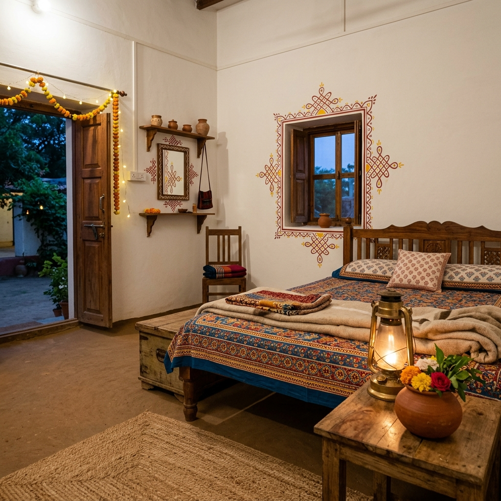
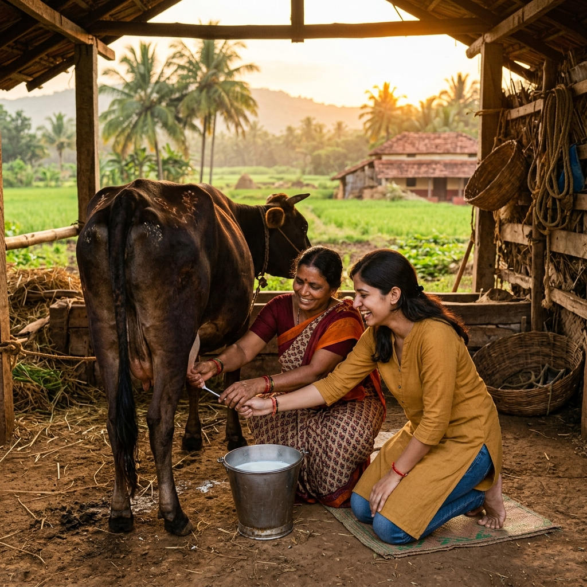

# 🌿 Grama-Vasathi — Rural Home-stay Accelerator

> *"Matti-Vasane"* — The scent of the soil. Bridging the Urban-Rural divide through authentic farm-stay experiences.


---

## 📖 About the Project

**Grama-Vasathi** is a *Rural Home-stay Accelerator* that acts as a two-sided platform:

- 🏡 **For Hosts (Villagers):** A *Hospitality School* — giving actionable tips on room setup, hygiene standards, and food serving via an interactive wizard-style training checklist.
- 🌆 **For Guests (City Dwellers):** A *Verified Catalog* of authentic farm-stays where they can live the true rural experience — from cow milking to field plowing.

This project directly supports the **Vikshit Bharat** vision by:
- Enabling **Reverse Migration** — making villages attractive economic destinations.
- Fostering **Cultural Exchange** — bridging the urban-rural gap through shared living.
- Providing **Income Diversification** — giving farmers non-agri income during lean seasons.

---

## ✨ Features

### 🎯 For Guests
| Feature | Description |
|---|---|
| 🔍 **Verified Farm Catalog** | Browse a curated list of verified rural home-stays |
| 🏷️ **Activity Filters** | Filter stays by Cow Milking, Field Plowing, Local Cooking, Birdwatching |
| 📅 **Simulated Booking** | Pick check-in/out dates and reserve a stay with instant confirmation |
| 📖 **Cultural Guide** | Learn how to greet locals, what to wear, and dining etiquette |

### 🏡 For Hosts
| Feature | Description |
|---|---|
| 🧑‍🏫 **Hospitality School** | Step-by-step wizard covering Hygiene, Room Setup & Food |
| 📊 **Readiness Score** | Animated circular score (out of 100%) with actionable feedback |
| ✅ **Verified Badge** | Hosts scoring 80%+ earn the "Verified Host" status |

---

## 🛠️ Tech Stack

### Web Application
- **HTML5** — Semantic structure
- **CSS3** — Glassmorphism, animations, responsive design
- **Vanilla JavaScript** — Dynamic catalog, filtering, stepper logic

### Android App
- **Kotlin** — Native Android (MainActivity.kt)
- **WebView** — Renders the full web UI inside a native Android shell
- **Android SDK 34** — Target SDK, min SDK 24 (Android 7.0+)
- **Gradle** — Build system

---

## 📁 Project Structure

```
Grama-Vasathi/
│
├── 📄 index.html              # Main web application entry point
├── 🎨 styles.css              # Full design system (earthy tones, animations)
├── ⚙️  app.js                  # JavaScript logic (catalog, stepper, booking)
│
├── 📂 assets/                 # AI-generated images for the web app
│   ├── hero_farm.png
│   ├── farm_room.png
│   └── cow_milking.png
│
└── 📂 GramaVasathiApp/        # Android Studio Kotlin Project
    ├── build.gradle           # Project-level Gradle config
    ├── settings.gradle        # Project settings
    └── app/
        ├── build.gradle       # App-level Gradle (SDK versions, dependencies)
        └── src/main/
            ├── AndroidManifest.xml
            ├── java/com/gramavasathi/app/
            │   └── MainActivity.kt     # Kotlin entry point with WebView setup
            ├── res/
            │   ├── layout/activity_main.xml
            │   └── values/ (themes, strings, colors)
            └── assets/                # Web files bundled into the APK
                ├── index.html
                ├── styles.css
                ├── app.js
                └── assets/ (images)
```

---

## 🚀 How to Run

### Option 1: Run the Web App (Instant — No Server Needed)
1. Clone this repository:
   ```bash
   git clone https://github.com/shaz74/Grama-Vasathi.git
   ```
2. Navigate to the project folder.
3. Double-click **`index.html`** to open it in your browser. Done!

---

### Option 2: Run the Android App in Android Studio
1. Open **Android Studio**.
2. Click **Open** → navigate to the `GramaVasathiApp` folder → click OK.
3. Wait for **Gradle Sync** to complete (1–3 minutes).
4. Select an emulator or plug in your Android device.
5. Click the ▶️ **Run** button.

> **Requirements:** Android Studio Hedgehog (2023.1.1) or newer. JDK 8+.

---

## 📸 App Screenshots

| Hero / Landing | Farm Catalog | Host Academy |
|---|---|---|
|  |  |  |

---

## 🏆 Success Criteria (Met ✅)

- [x] **Host Readiness Score** calculated and animated from checklist inputs
- [x] **Activity Filtering** — filter farm-stays by Birdwatching, Cow Milking, etc.
- [x] **Warm & Homy UI** — earthy sage greens, terracotta, and Playfair Display typography
- [x] **Wizard/Stepper** for host training (Hygiene → Room Setup → Food & Greeting)
- [x] **Simulated Booking** with calendar date picker and success confirmation
- [x] **Cultural Guide** section for city guests
- [x] **Verified Badge** system for trained hosts
- [x] **Responsive Design** — works on desktop, tablet, and mobile

---

## 🌱 Vikshit Bharat Impact

> This project is built with the **"Vikshit Bharat"** vision in mind, aiming to empower rural India by creating dignified income opportunities for farming families and authentic cultural exchange experiences for urban citizens.

---

## 👨‍💻 Author

**Mohammed Shaz**
- GitHub: [@shaz74](https://github.com/shaz74)
- Project: [Grama-Vasathi](https://github.com/shaz74/Grama-Vasathi)

---

## 📄 License

This project is open source and available for educational use.

---

<p align="center">Made with ❤️ for rural India | <em>"Matti-Vasane"</em> 🌿</p>
